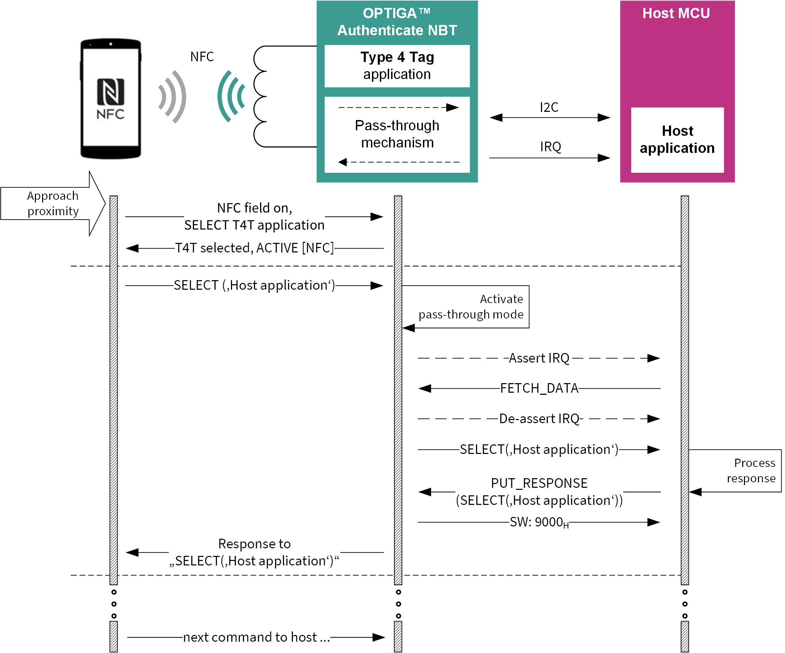

<!--
SPDX-FileCopyrightText: Copyright (c) 2024-2025 Infineon Technologies AG
SPDX-License-Identifier: MIT
-->

# OPTIGA™ Authenticate NBT PT Application for Android

This is the *NBT Pass-Through (PT)* mobile phone app, a Java-based *Android Studio* project which showcases the OPTIGA™ Authenticate NBT in the *host parameterization via pass-through (PT)* use case.

## Overview

The example application enables an Android mobile phone to perform synchronous NFC communication with a host device holding an embedded OPTIGA™ Authenticate NBT.
The main purpose of this implementation is to showcase the OPTIGA™ Authenticate NBT's *PT mode* and to provide a simple example on how to use the [OPTIGA™ Authenticate NBT Host Library for Java](https://github.com/infineon/optiga-nbt-lib-java) in Android applications.

Refer to the [OPTIGA™ Authenticate NBT - GitHub overview](https://github.com/Infineon/optiga-nbt) repository for an overview of the available host software for the OPTIGA™ Authenticate NBT. The [OPTIGA™ Authenticate NBT - product page](https://www.infineon.com/OPTIGA-Authenticate-NBT) includes a dedicated Use Case Guide with detailed information on how to use the OPTIGA™ Authenticate NBT's PT functionality.

### Features

- Android application with user interface and NFC communication capability
- Example implementation of the OPTIGA™ Authenticate NBT's PT mode functionality
- Synchronous NFC communication  with a host via the OPTIGA™ Authenticate NBT
- Sample usage of the [OPTIGA™ Authenticate NBT Host Library for Java](https://github.com/infineon/optiga-nbt-lib-java) (version 1.1.1)

## Getting started

Information on how to setup and use this example application to evaluate the OPTIGA™ Authenticate NBT's *host parameterization via PT* use case.

### Requirements

- NFC-enabled Android device running on API level 30 or higher (Android 11+)
- [OPTIGA™ Authenticate NBT Development Kit](https://www.infineon.com/OPTIGA-Authenticate-NBT-Dev-Kit), consisting of:
  - [OPTIGA™ Authenticate NBT Development Shield](https://www.infineon.com/OPTIGA-Authenticate-NBT-Dev-Shield)
  - [PSOC™ 62S2 Wi-Fi Bluetooth® Prototyping Kit](https://www.infineon.com/CY8CPROTO-062S2-43439) as host microcontroller board
- Associated example applications
  - *NBT Pass-Through* mobile phone app ([Android](https://github.com/Infineon/optiga-nbt-example-pt-android) **\*this application\*** or [iOS](https://github.com/Infineon/optiga-nbt-example-pt-ios))
    - Mobile phone example application for the *host parameterization via PT* use case
  - *NBT Pass-Through* embedded application ([ModusToolbox™](https://github.com/Infineon/mtb-example-optiga-nbt-pt))
    - Embedded example application for the *host parameterization via PT* use case
    - Targets the [PSOC™ 62S2 Wi-Fi Bluetooth® Prototyping Kit](https://www.infineon.com/CY8CPROTO-062S2-43439), included in the [OPTIGA™ Authenticate NBT Development Kit](https://www.infineon.com/OPTIGA-Authenticate-NBT-Dev-Kit)
  - *NBT Personalization* mobile phone app ([Android](https://github.com/Infineon/optiga-nbt-example-perso-android) or [iOS](https://github.com/Infineon/optiga-nbt-example-perso-ios))
    - (Optional) Mobile phone example application for the *personalization of the OPTIGA™ Authenticate NBT via NFC*
    - To configure the OPTIGA™ Authenticate NBT for the desired use case or to reset it to its delivery condition

### Setup

This project is shared to be loaded and compiled using *Android Studio*. To do this, it is sufficient to download and import the project into *Android Studio* (by selecting File --> Open).

The associated example applications for this use case must be loaded onto their target devices.

- The embedded application needs to be flashed on the OPTIGA™ Authenticate NBT Development Kit
  - For flashing the PSOC™ microcontroller, it is recommended to use *ModusToolbox™*
- The mobile phone app(s) need to be installed on the mobile phone
  - For installing Android applications, it is recommended to use *Android Studio*
  - For installing iOS applications, it is recommended to use *Xcode*

### Usage

The example applications showcase the *host parameterization via PT* use case by utilizing the OPTIGA™ Authenticate NBT's PT functionality to transfer data from an NFC-enabled mobile phone to the embedded host system via NFC/I2C.

The use case is demonstrated with the simple example to parametrize the state of a LED on the OPTIGA™ Authenticate NBT Development Kit from the mobile phone app. Depending on the data sent by the Android application, the PSOC™'s LED is switched on or off.
In synchronous *PT mode*, the data is instantaneously transferred between the OPTIGA™ Authenticate NBT's NFC and I2C interface.

To evaluate the use case, follow these steps:

- Make sure that NFC is enabled on the Android device
- Make sure that the OPTIGA™ Authenticate NBT is connected before powering the OPTIGA™ Authenticate NBT Development Kit
- Launch the *NBT Pass-Through* mobile phone app
- Select the desired LED state in the GUI
- Tap the mobile phone to the OPTIGA™ Authenticate NBT and see the LED turn on/off

## Operational use case flow

In *PT mode*, the OPTIGA™ Authenticate NBT acts as a synchronous NFC to I2C bridge between the mobile phone and the host device which is connected via I2C to the OPTIGA™ Authenticate NBT. This means that the OPTIGA™ Authenticate NBT allows direct communication between the mobile phone and the host device by tunneling bi-directional communication between the NFC and I2C interfaces.

To perform a synchronous data transfer via PT, the mobile phone initiates an NFC communication, selects a proprietary application on the host system (that is not present on the OPTIGA™ Authenticate NBT's T4T Application itself), and follows the proprietary application-specific protocol.

The following figure depicts the command flow of a synchronous data transfer. In the figure, it is shown how the host application is selected by a mobile phone. At this point the user can continue with further interactions like a host configuration.
This Android application is a very simple host configuration example, turning an LED on or off on the host board.

## Graphical User Interface (GUI)

The GUI enables the user to interact with the Android application. In this particular use case, the user can enable or disable an LED on a host board using the OPTIGA™ Authenticate NBT in the *PT mode*.

To demonstrate a potential synchronous data transfer, this example is sending an on/off command to control a LED on the [PSOC™ 62S2 Wi-Fi Bluetooth® Prototyping Kit](https://www.infineon.com/CY8CPROTO-062S2-43439).

The user can enable or disable the LED using the *Disable LED / Enable LED* button in the middle of the GUI. To transfer the selected setting, the OPTIGA™ Authenticate NBT needs to be tapped to the mobile phone to initiate the data exchange.

## High-level application flow

The first and only activity to be started is the `MainActivity`, where the user can control the LED button.

To write to the host device, the user needs to set the desired state of the LED using the LED button in the GUI and tap the antenna of the OPTIGA™ Authenticate NBT device to the mobile phone. The detection of the NFC tag will trigger a cascade of commands that are handled in the methods of the `PassThroughUsecase` class.

`setStateByPassThrough()` will:

1. Select the proprietary demonstrator application on the host device
2. Write the LED state into the host application using a simple proprietary command

## Additional information

### Related resources

- [OPTIGA™ Authenticate NBT - product page](https://www.infineon.com/OPTIGA-Authenticate-NBT)
- [OPTIGA™ Authenticate NBT - GitHub overview](https://github.com/Infineon/optiga-nbt)

### Contributing

Please read [CONTRIBUTING.md](CONTRIBUTING.md) for detailed contribution instructions and refer to our [CODE_OF_CONDUCT.md](CODE_OF_CONDUCT.md).

### Contact

In case of questions regarding this repository and its contents, refer to [MAINTAINERS.md](MAINTAINERS.md) for the contact details of this project's maintainers.

## Licensing

Please see our [LICENSE](LICENSE) for copyright and license information.

This project follows the [REUSE](https://reuse.software/) approach, so copyright and licensing
information is available for every file (including third party components) either in the file
header, an individual *.license file or the [REUSE.toml](REUSE.toml) file. All licenses can be found in the
[LICENSES](LICENSES) folder.
